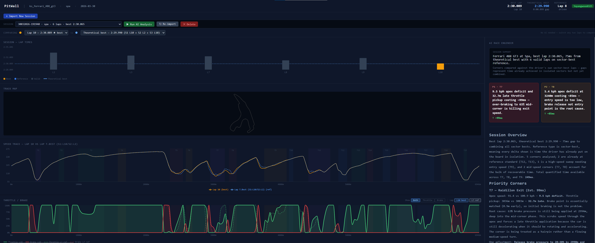

# PitWall

> **Want your own Peter Bonnington? Your own GP Lambiase? Here's one — and it never sleeps.**

In F1, the voice in your ear makes the difference. Bono tells Lewis exactly where he's losing time. GP tells Max precisely where to push harder. That relationship — driver and race engineer, data and instinct — is what separates a good lap from a great one.

PitWall brings that to sim racing.

After every Assetto Corsa session, PitWall reads your telemetry, runs it through a pipeline of specialised AI agents, and delivers the kind of corner-by-corner coaching that usually only exists in a professional motorsport garage. Not generic advice — specific data. *"You're braking 12 metres earlier than your reference at T4. That's 263ms. Here's what to do about it."*



### How the telemetry gets captured

On track, [Telemetrick](https://www.telemetrick.com/) runs inside Assetto Corsa and logs everything — speed, throttle, brake, steering, G-forces — at 30Hz into a MoTeC `.ld` file. The moment you finish a session, PitWall picks it up automatically (via file watcher), ingests it into SQLite, and has your coaching report ready before you've taken your helmet off.

No manual export steps. No copying files. Just drive, then read.

---

## What it does

After each session, PitWall:

1. **Captures** your `.ld` telemetry automatically via [Telemetrick](https://www.telemetrick.com/) — file watcher ingests it the moment AC writes it
2. **Compares** your laps corner-by-corner — brake points, minimum speed, throttle pickup
3. **Runs** specialist AI agents (braking efficiency, balance diagnosis, corner analysis) to identify exactly where time is lost
4. **Delivers** a prioritised coaching report: the biggest problem first, specific numbers, actionable fixes
5. **Renders** everything in a visual dashboard — speed traces, input overlays, corner delta tables

**Works with any car and any track in Assetto Corsa** — no per-track configuration needed. Just drive, export, and analyse.

---

## Architecture

```
[Assetto Corsa + Telemetrick]
      ↓  exports .ld + .ldx after session
[ingest.py]  →  [SQLite]
                    ↓
              [MCP Server]        ←  6 tools, pure data retrieval, zero analysis
                    ↓
       [Data Gatherer Agent]      ←  only agent with MCP access
                    ↓ SessionPayload
         [Orchestrator Claude]    ←  coordinates, never analyses
          ├── Corner Analysis Agent
          ├── Braking Efficiency Agent
          ├── Balance Diagnosis Agent
          ├── Synthetic Lap Agent
          └── Coaching Writer Agent
                    ↓
         [dashboard.json]  →  [React Dashboard]
```

### Design principles

- **MCP is a data boundary.** MCP tools do zero calculation — pure SQL queries and file reads. All racing knowledge lives in agents.
- **One agent, one lens.** The Corner Analysis Agent doesn't know about braking physics. The Coaching Writer doesn't know about raw data. Responsibilities never bleed.
- **Context minimisation.** Each agent receives only the channels and distance range it needs. Small context = faster, cheaper, more accurate.
- **JSON contracts.** All inter-agent communication is typed JSON. No prose passes between agents.
- **Orchestrator coordinates, never analyses.** It decides which corners to focus on, which agents to spawn, and in what order. That's it.
- **Prompt files are the knowledge layer.** Swap coaching philosophy by editing a `.txt` file — no Python touched.
- **Graceful degradation.** Missing `AC_ROOT`? Skip synthetic laps. Missing channel? Store NULL and continue. The report is always produced.

---

## Quick Start

### Prerequisites

- Python 3.11+
- Node.js 18+
- [Anthropic API key](https://console.anthropic.com)
- Assetto Corsa + [Telemetrick](https://www.telemetrick.com/) (to export `.ld` files)

### Install

```bash
git clone https://github.com/yyw860531/Pitwall.git
cd Pitwall

# Python dependencies
pip install -r requirements.txt

# ldparser (MoTeC .ld file parser)
git clone https://github.com/gotzl/ldparser.git

# Dashboard dependencies
cd dashboard && npm install && cd ..
```

### Configure

```bash
cp .env.example .env
```

Then edit `.env` — here's what each variable does:

```bash
# ── Required ──────────────────────────────────────────────────────────────────
ANTHROPIC_API_KEY=your_key_here

# ── Model selection ───────────────────────────────────────────────────────────
# Sonnet for reasoning/language agents (coaching_writer, data_gatherer, synthetic_lap)
CLAUDE_MODEL=claude-sonnet-4-6

# Haiku for calculation-only agents (corner_analysis, braking_efficiency, balance_diagnosis)
# These agents produce structured JSON — Haiku is faster and ~20× cheaper here.
CLAUDE_MODEL_FAST=claude-haiku-4-5

# ── Assetto Corsa installation ─────────────────────────────────────────────────
# Required for synthetic reference laps. Leave blank to skip that agent.
# Example (Windows): C:\Program Files (x86)\Steam\steamapps\common\assettocorsa
AC_ROOT=

# ── Storage paths (defaults shown — only change if you need to) ────────────────
PITWALL_DB_PATH=db/pitwall.db
PITWALL_DATA_DIR=data/sessions

# ── Telemetrick auto-discovery ─────────────────────────────────────────────────
# Root folder of your Telemetrick exports. If set, run_session.py can find
# sessions without you specifying the full file path.
# Example: C:\Users\YourName\Documents\Assetto Corsa\apps\telemetrick\exported\YourDriver
TELEMETRY_EXPORT_DIR=

# ── Lap validity filter ────────────────────────────────────────────────────────
# Laps outside this window are marked invalid when the 'Lap Invalidated'
# channel is absent from the .ld file.
PITWALL_VALID_LAP_MIN_MS=30000
PITWALL_VALID_LAP_MAX_MS=120000
```

### Run

```bash
# Ingest a session and generate coaching report
python scripts/run_session.py data/sessions/your_session.ld

# Data-only export (skip AI agents — much faster)
python scripts/run_session.py data/sessions/your_session.ld --no-agents

# Re-run analysis on a previously ingested session
python scripts/run_session.py --session-id 28032026-155415

# List all ingested sessions
python scripts/run_session.py --list

# Start the dashboard
cd dashboard && npm run dev
# Open http://localhost:5173
```

> **Tip:** Drive at least 3–4 clean laps per session. PitWall needs multiple laps to detect corners from lateral-G patterns, compute a meaningful theoretical best, and compare your best against a reference.

---

## Data Flow in Detail

### 1. Ingest (`.ld` → SQLite)

`ingest.py` uses [ldparser](https://github.com/gotzl/ldparser) to parse MoTeC binary files exported by Telemetrick. It extracts all laps, stores sample-by-sample telemetry at 30Hz, and computes sector times using real sector boundaries from AC's `sections.ini` (supporting 2 or 3 sectors depending on the track).

Channels stored: `Ground Speed`, `Throttle Pos`, `Brake Pos`, `Steering Angle`, `Gear`, `Engine RPM`, `Lap Distance`, `CG Accel Lateral`, `CG Accel Longitudinal`.

Track length is derived from telemetry data (maximum lap distance), so no per-track configuration is needed.

Lap validity is determined by the `Lap Invalidated` channel if present, otherwise by a dynamic heuristic based on venue length (minimum speed floor of 30 kph). Falls back to configurable time-range (30s–120s) if venue length is unknown.

### 2. MCP Server (data layer)

`server.py` exposes 6 tools over the MCP protocol (stdio transport). None of these tools do analysis:

| Tool | Returns |
|------|---------|
| `list_sessions()` | All ingested sessions |
| `list_laps(session_id)` | Laps with metadata for a session |
| `get_lap_trace(lap_id, channels, start_m, end_m)` | Raw samples for a distance range |
| `get_session_metadata(session_id)` | Car specs, gear ratios, fastest lap |
| `get_ac_car_data(car_id)` | Physics parameters from AC installation (tyre grip, aero, drivetrain) |
| `get_ac_track_line(track_id)` | Track geometry + auto-detected corner map (handles multi-layout tracks) |

### 3. Agent pipeline

| Agent | Input | Output |
|-------|-------|--------|
| **Data Gatherer** | Session ID | SessionPayload — all traces needed for analysis |
| **Corner Analysis** | Target + reference trace for one corner | Brake point, min speed, throttle pickup, delta |
| **Braking Efficiency** | Brake zone trace | Deceleration rate, trail brake detection |
| **Balance Diagnosis** | Steering + lat G trace | Understeer/oversteer diagnosis, onset distance |
| **Synthetic Lap** | Car physics + track geometry | Theoretical fastest lap (point-mass model) |
| **Coaching Writer** | All agent outputs | Human coaching report (markdown + JSON) |

### 4. Dashboard

React + Vite + Recharts. Reads `dashboard.json` produced by `export.py`.

Features:
- **Session overview** — lap time bar chart with theoretical best reference line, sector splits (S1/S2/S3)
- **Lap comparison selector** — compare any two laps head-to-head, or compare against the theoretical best (stitched from best sector times)
- **Speed trace overlay** — best lap vs. reference with aligned X-axis
- **Throttle / brake trace** — input overlay, shows early braking and late throttle
- **Track map** — auto-detected from AC installation (supports multi-layout tracks like Red Bull Ring)
- **Corner summary table** — delta per corner, colour-coded, sorted by time loss
- **Coaching panel** — full report from Claude, priority corners highlighted

---

## Project Structure

```
PitWall/
├── config.py                    # Typed config loader (reads .env)
├── requirements.txt
├── .env.example
├── ldparser/                    # Cloned from github.com/gotzl/ldparser
├── data/
│   └── sessions/                # Drop .ld + .ldx files here
├── db/
│   └── pitwall.db               # SQLite (gitignored)
├── pitwall/
│   ├── ingest.py                # .ld → SQLite (N-sector support)
│   ├── server.py                # FastMCP server — 6 data tools
│   ├── orchestrator.py          # Coordinates all agents via Claude Agent SDK
│   ├── export.py                # DB → dashboard.json
│   ├── track.py                 # Corner detection + AC track/sector parsing
│   └── agents/
│       ├── data_gatherer.py     # MCP-connected data fetch agent
│       ├── corner_analysis.py
│       ├── braking_efficiency.py
│       ├── balance_diagnosis.py
│       ├── synthetic_lap.py
│       └── coaching_writer.py
├── prompts/                     # Agent system prompts — edit to tune coaching
│   ├── orchestrator.txt
│   ├── data_gatherer.txt
│   ├── corner_analysis.txt
│   ├── braking_efficiency.txt
│   ├── balance_diagnosis.txt
│   ├── synthetic_lap.txt
│   └── coaching_writer.txt
├── scripts/
│   ├── run_session.py           # CLI: ingest + analyse + export
│   ├── watch_telemetry.py       # File watcher: auto-ingest on .ld drop
│   └── set_reference_lap.py    # CLI: mark a lap as the reference
└── dashboard/
    ├── public/
    │   └── mock_session.json    # Static demo data
    └── src/
        ├── App.jsx
        └── components/
            ├── SessionHeader.jsx
            ├── LapTimeBarChart.jsx
            ├── SpeedTraceChart.jsx
            ├── InputTraceChart.jsx
            ├── CornerSummaryTable.jsx
            ├── CoachingPanel.jsx
            └── LapCompareSelector.jsx
```

---

## Configuration

| Variable | Required | Default | Description |
|----------|----------|---------|-------------|
| `ANTHROPIC_API_KEY` | **Yes** | — | Your Anthropic API key |
| `CLAUDE_MODEL` | No | `claude-sonnet-4-6` | Model for reasoning/language agents (coaching writer, data gatherer, synthetic lap) |
| `CLAUDE_MODEL_FAST` | No | `claude-haiku-4-5` | Model for calculation-only agents (corner analysis, braking, balance). Haiku is ~20× cheaper for structured JSON tasks |
| `AC_ROOT` | No | — | Path to your AC installation. Enables track map, real sector boundaries, synthetic reference laps |
| `TELEMETRY_EXPORT_DIR` | No | — | Root of your Telemetrick export folder. Enables session auto-discovery |
| `PITWALL_DB_PATH` | No | `db/pitwall.db` | SQLite database path |
| `PITWALL_DATA_DIR` | No | `data/sessions` | Session files directory |
| `PITWALL_VALID_LAP_MIN_MS` | No | `30000` | Minimum valid lap time (ms) |
| `PITWALL_VALID_LAP_MAX_MS` | No | `120000` | Maximum valid lap time (ms) |

---

## Tech Stack

| Layer | Technology |
|-------|------------|
| Telemetry parsing | [ldparser](https://github.com/gotzl/ldparser) |
| Storage | SQLite |
| AI orchestration | [Claude Agent SDK](https://anthropic.com) |
| Agent interface | [FastMCP](https://github.com/jlowin/fastmcp) |
| Dashboard | React + Vite + Recharts |

---

## Security

- API keys are loaded from `.env` — never logged, never committed
- All SQL queries use parameterised statements (`?` placeholders)
- File paths from user-supplied IDs are validated against a safe base directory (path traversal blocked)
- Agent responses are parsed as JSON — never `eval()`'d
- `.ld` files are validated (exists, regular file, `.ld` extension, within `data_dir`, <500MB)

---

## Roadmap

- [ ] External reference lap — import a faster driver's `.ld` or AC AI ghost as a cross-session benchmark
- [ ] Multi-session progress tracking ("T4 improved 0.3s over 3 sessions")
- [ ] Voice coaching between laps (text-to-speech via Coaching Writer)
- [ ] Web UI with live MCP connection
- [x] Any car, any track support — no per-track hardcoding
- [x] Real sector boundaries from AC `sections.ini` (2 or 3 sectors)
- [x] Corner detection from lateral-G telemetry (no AI file needed)
- [x] Lap comparison selector with theoretical best trace
- [x] Track map auto-detection (multi-layout tracks supported)

---

## Contributing

Contributions welcome. Please open an issue before submitting a PR for new features.

If you're a sim racer who wants to add support for a different track or car — that's the best kind of issue to open.

---

## License

MIT

---

*Built with Claude, FastMCP, and the belief that every driver deserves a GP Lambiase in their corner.*
